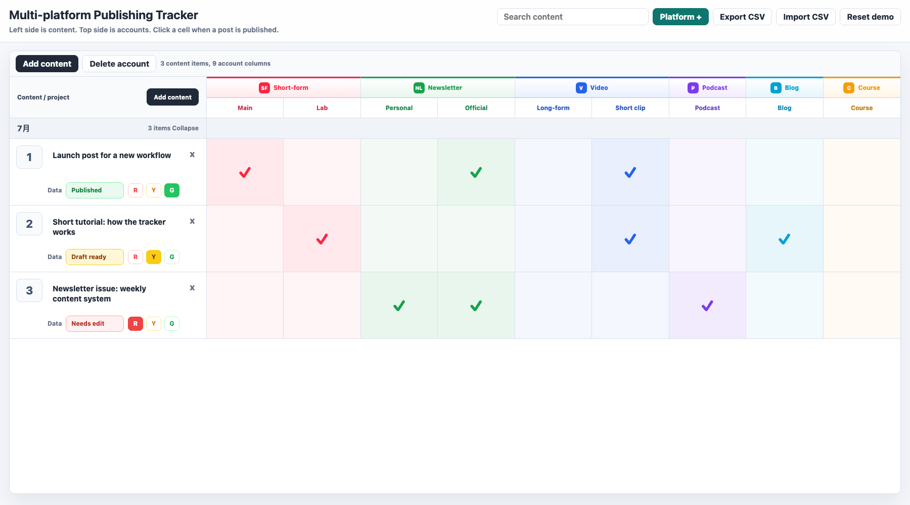
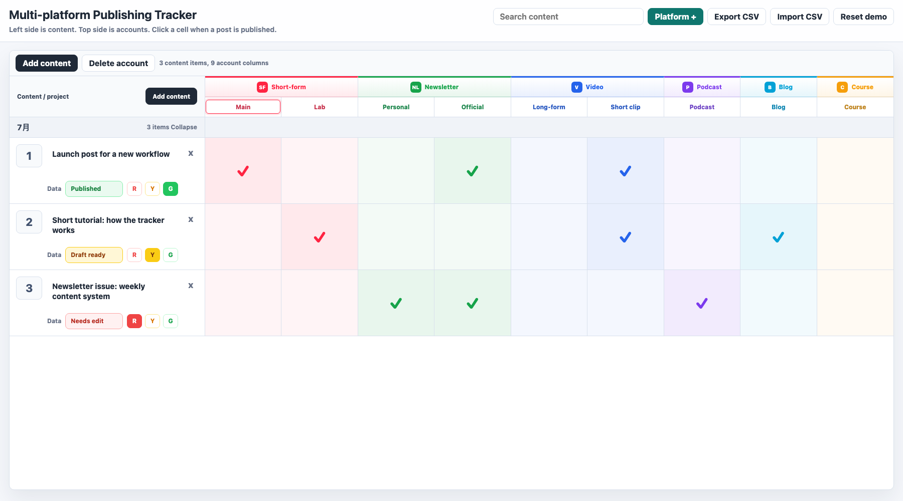
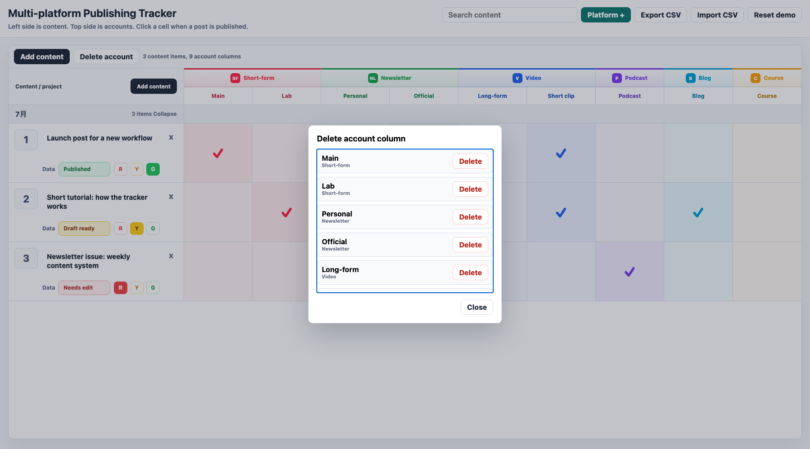

# Multi-platform Publishing Tracker

A simple local-first publishing checklist for creators, indie teams, and content operators who repurpose one idea across many platforms.

It is a single-page web app. No signup, no database, no backend required. Open it in a browser and your data is saved in Local Storage.



## Search Keywords

English keywords:

`multi platform publishing`, `content publishing tracker`,
`social media publishing checklist`, `creator content calendar`,
`content distribution workflow`, `publishing status tracker`,
`repurpose content across platforms`, `newsletter publishing checklist`,
`podcast content distribution`, `local-first content tracker`.

中文关键词：

`多平台发布`, `内容发布追踪`, `发布状态表`, `创作者发布清单`,
`自媒体内容分发`, `多账号发布`, `发布日历`, `内容复盘提醒`,
`内容运营工具`, `创作者工具`.

## What It Does

- Track one content idea across multiple platforms and accounts.
- Click cells to mark where a piece has already been published.
- Edit platform account names directly in the table header.
- Add or delete platform/account columns.
- Add notes or performance labels to each content row.
- Collapse months to focus on recent work.
- Export and import CSV files.

## Why This Exists

Most content teams do not need a complex project management system for distribution. They need a visible grid:

- rows = content ideas or projects
- columns = platforms and accounts
- checkmarks = already published

This project is intentionally small so people can adapt it to their own workflow.

## Who It Is For

Use this tracker if you:

- publish one idea across multiple platforms
- run several social accounts at the same time
- turn podcast episodes into clips, notes, articles, and posts
- need a visible checklist instead of a heavy project-management tool
- want a local-first tracker that can be backed up with CSV

## Agent Skill

There is also a companion open Skill:

<https://github.com/atian-create/multi-platform-publishing-tracker-skill>

The web app gives you the local-first grid. The Skill helps an AI Agent turn a
messy content package into platform rows, account columns, status labels,
missing-item checks, CSV-friendly tracker rows, and 24h / 48h / 7d review
reminders.

## Quick Start

Option 1: open directly

```bash
open index.html
```

Option 2: run a local server

```bash
python3 -m http.server 8765
```

Then open:

```text
http://127.0.0.1:8765/
```

## How To Customize

1. Click `Platform +` to add your own platform group and account.
2. Click any account name in the table header to rename it.
3. Click `Add content` to add a new content idea.
4. Click a cell when that content has been published to that account.
5. Use `Export CSV` for backup or spreadsheet editing.

## Privacy

The app stores data in your browser's Local Storage. It does not send your content anywhere.

If you clear browser data, Local Storage may be removed. Export a CSV backup if the tracker matters to you.

## Screenshots

### Overview


### Editing Account Names



### Add or Delete Accounts



## Files

- `index.html` - the full app
- `REDDIT_POST.md` - suggested Reddit post copy
- `assets/screenshots/` - clean demo screenshots

## License

MIT
